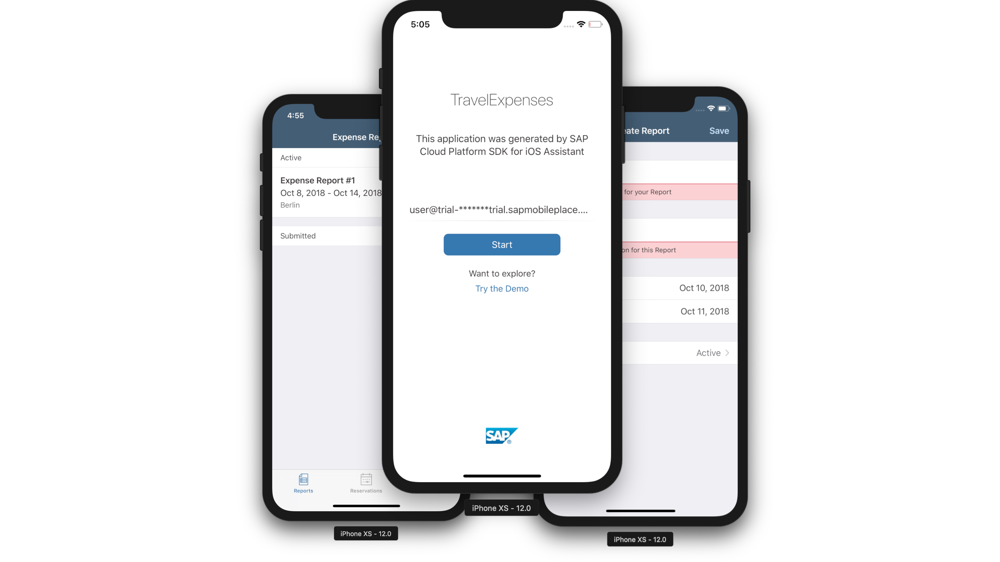

# Fiori for iOS Workshop

This repository contains a demo application which you can use as a reference on how a travel expense application could look like.

# Prerequisites
To use the reference app you need the following:

- [SAP Cloud Platform Trial Account](https://account.hanatrial.ondemand.com/#/home/welcome)

- [SAP Cloud Platform SDK for iOS](https://www.sap.com/developer/trials-downloads/additional-downloads/sap-cloud-platform-sdk-for-ios-14485.html), version 3.0 or higher

- Xcode 10 which you can download from the App Store or from https://developer.apple.com

- Clone this repository to your local file system

# Download and installation

To get the application up and running, please follow this guide:
[Getting Started](https://github.com/SAP/fiori-for-ios-workshop/blob/master/GettingStarted.md)

# Limitations
 - Trips view controller does not navigate to trip details
 - Unable to edit properties on existing Expense Items

# Known Issues
None

# How to obtain support
Official support is not provided under the terms of the SAP Developer License Agreement. For questions, please open an Issue on the project.

# Contributing
If you would like to contribute ideas or code to the project, please open an Issue, or a Pull Request.
> Project Administrators do not commit to integrating any contributions to the project.  Contributors acknowledge that by submitting the contribution, they waive all rights to any  Intellectual Property associated with the contribution, and that any contributions which are integrated to the project will be redistributed under the terms of the SAP Developer License Agreement, under copyright by SAP.

# License
Use of the code is governed by the terms of the SAP Developer License Agreement (see **LICENSE**, and **NOTICE**).
